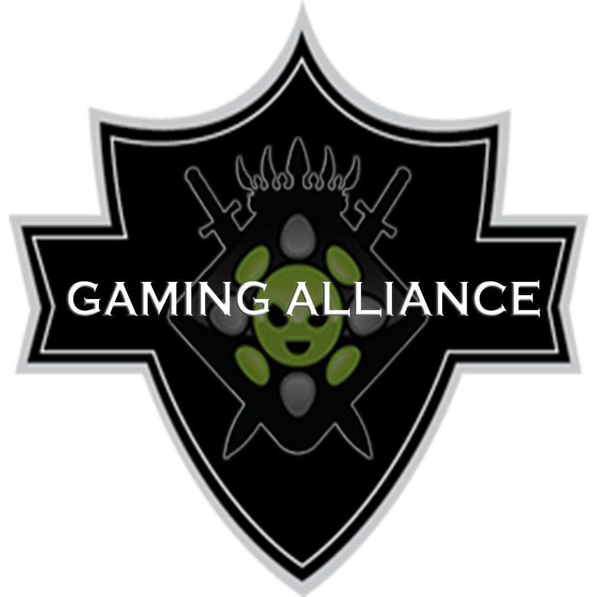

# Documentation

Helpful links, guides and mod wikis for the modpack. *(Work in progress — more coming soon.)*

## Getting started

- How to join the server *(coming soon)*
- Controls & keybinds *(coming soon)*

## Featured mods

- [Cobblemon Wiki](https://wiki.cobblemon.com/) — catch, train and battle Pokémon in Minecraft.
- [Cobbleverse Wiki](https://www.lumyverse.com/cobbleverse/why-should-i-play-cobbleverse/) — defeat gym, league and unlock new regions in Minecraft.
- [Legendary Monuments Wiki](https://legendary-monuments.gitbook.io/legendary-monuments-wiki/) — explore, summon and catch legendary Pokémon in Minecraft.

---

*Launcher and Game Server built by `Ripsey` for `GamingAlliance.net`. Report any incident on our Discord.*